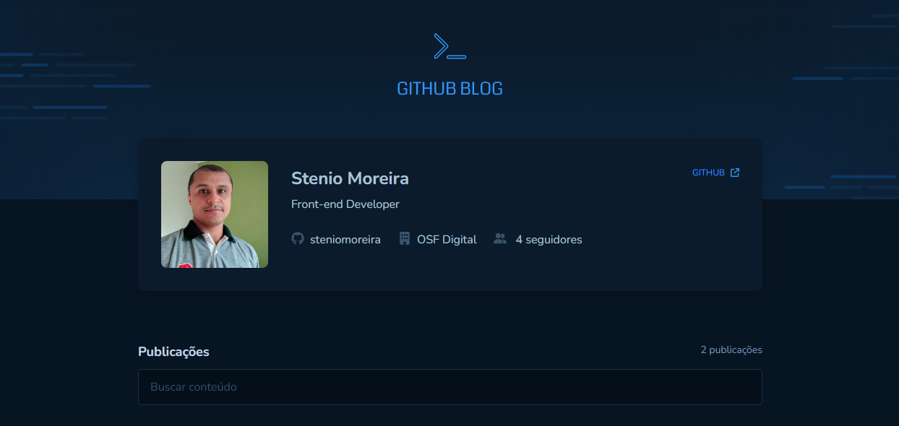
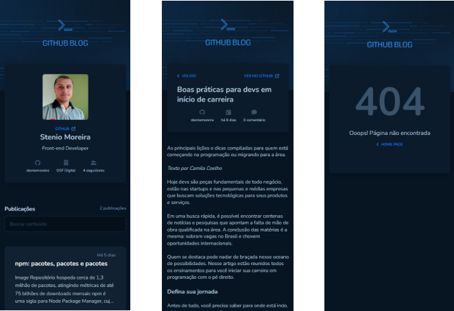
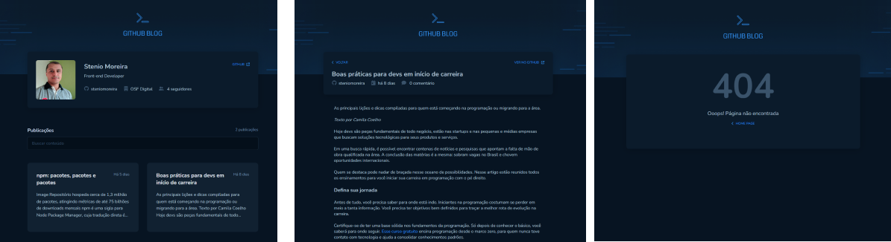

<h1 align="center">
    
</h1>

<h4 align="center"> 
	🚧  Github Blog 🤓 Concluído 🚀 🚧
</h4>

<p align="center">
 <a href="#-sobre-o-projeto">Sobre</a> •
 <a href="#-funcionalidades">Funcionalidades</a> •
 <a href="#-layout">Layout</a> • 
 <a href="#-como-executar-o-projeto">Como executar</a> • 
 <a href="#-tecnologias">Tecnologias</a> •
 <a href="#user-content--licença">Licença</a>
</p>

## 💻 Sobre o projeto

🗒️ Nesta aplicação é utilizada a API do GitHub para buscar issues de um repositório, dados do perfil e exibir elas como um blog.

---

## ⚙️ Funcionalidades

- [x] Listagem do seu perfil com imagem, número de seguidores, nome e outras informações disponíveis pela API do GitHub
- [x] Listar e filtrar todas as issues do repositório com um pequeno resumo do conteúdo dela
- [x] Página para exibir um post (issue) completo

---

## 🎨 Layout

### Mobile

<p align="center">
  
</p>

### Web

<p align="center" style="display: flex; align-items: flex-start; justify-content: center;">
  
</p>

## 🚀 Como executar o projeto

### Pré-requisitos

Antes de começar, você vai precisar ter instalado em sua máquina as seguintes ferramentas:
[Git](https://git-scm.com), [Node.js](https://nodejs.org/en/). 
Além disto é bom ter um editor para trabalhar com o código como [VSCode](https://code.visualstudio.com/)

#### 💡 Rodando a aplicação web (Frontend)

```bash

# Clone este repositório
$ git clone git@github.com:steniomoreira/github-blog.git

# Acesse a pasta do projeto no seu terminal/cmd
$ cd github-blog

```

Adicione o arquivo .env.local na raiz do projeto com as seguites variáves de ambiente

```bash
  VITE_GITHUB_USER = seu-user-name
  VITE_GITHUB_REPO = github-blog

```

```bash

# Instale as dependências
$ npm install

# Execute a aplicação em modo de desenvolvimento
$ npm run dev

# A aplicação será aberta na porta:5173 (Vite) - acesse http://localhost:5173

```

---

## 🛠 Tecnologias

As seguintes ferramentas foram usadas na construção do projeto:

#### **Website**  ([React](https://reactjs.org/)  +  [TypeScript](https://www.typescriptlang.org/))

-   **[Vite](https://vitejs.dev/)**
-   **[React Hook Form](https://www.react-hook-form.com/)**
-   **[Styled Components](https://styled-components.com/)**
-   **[Axios](https://github.com/axios/axios)**
-   **[React Router Dom](https://reactrouter.com/en/main)**

> Veja o arquivo  [package.json](https://github.com/steniomoreira/github-blog/blob/main/package.json)

#### **Utilitários**

-   Protótipo:  **[Figma](https://www.figma.com/)**  →  **[Protótipo (Ecoleta)](https://www.figma.com/file/PBmEcpW8ilEqHcSRawad5R)**
-   Editor:  **[Visual Studio Code](https://code.visualstudio.com/)**
-   Markdown:  **[React Markdown](https://github.com/remarkjs/react-markdown)**
-   Commit Conventional:  **[Commitlint](https://github.com/conventional-changelog/commitlint)**
-   Ícones:  **[Font Awesome](https://fontawesome.com/)**
-   Fontes:  **[Nunito](https://fonts.google.com/specimen/Nunito)**

---

## 📝 Licença

Este projeto esta sobe a licença [MIT](./LICENSE).

Feito com ❤️ por Stenio Moreira 👋🏽 [Entre em contato!](https://github.com/steniomoreira)
